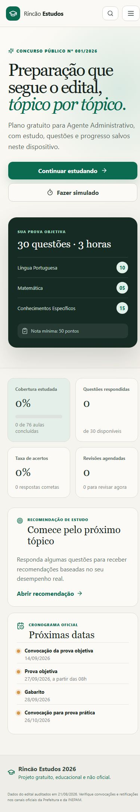

# Rincão Estudos 2026

Plataforma pública, gratuita e static-first para o Concurso Público nº 001/2026 da Prefeitura de Rincão-SP, destinada exclusivamente a Monitor de Educação, Agente Administrativo e Ajudante Geral.



## Recursos

- conteúdo rastreado por página e item do edital;
- cobertura estrutural de 74 tópicos para Monitor, 76 para Agente e 36 para Ajudante;
- aulas divididas por cargo, disciplina e tópico;
- banco de 90 questões inéditas, sempre identificado como tal;
- simulados com 30 questões na distribuição 10/5/15;
- modos prova e estudo;
- Caderno de Erros, favoritos, revisões e estatísticas;
- dados locais em IndexedDB/LocalStorage;
- exportação e importação de backup;
- PWA com suporte offline;
- preparação específica para a prova prática do Ajudante Geral;
- publicação gratuita pelo GitHub Pages.

## Desenvolvimento

```bash
pnpm install
pnpm dev
pnpm build
```

O mapa auditado e a cobertura tópico a tópico ficam em [`docs/MAPA-MESTRE-DO-EDITAL.md`](docs/MAPA-MESTRE-DO-EDITAL.md) e [`docs/cobertura-edital.md`](docs/cobertura-edital.md).

## Fontes e limites

O edital é a fonte primária. Textos legais apontam para fontes oficiais. Nenhuma questão é apresentada como real da INEPAM sem caderno integral e gabarito verificáveis. A plataforma não é oficial e o candidato deve acompanhar retificações e convocações nos canais da Prefeitura e da banca.

## Licença

O código é disponibilizado sob a licença MIT. Essa licença não concede direito de republicação de conteúdo de terceiros, provas, textos protegidos ou documentos oficiais além das permissões legais aplicáveis.
